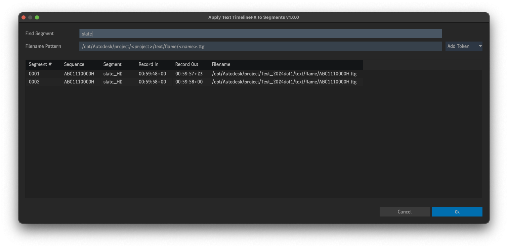

# Continue Folder

Plugin for [Autodesk Flame software](http://www.autodesk.com/products/flame).

Find specific segments in selected sequences then apply Text TimelineFX and load Text setups based on a token pattern.

Put simply... its for loading text setups in bulk!

## Tokens
- `AM/PM`
- `am/pm`
- `Day`
- `Hour (12hr)`
- `Hour (24hr)`
- `Minute`
- `Month`
- `Project`
- `Segment Name`
- `Sequence Name`
- `User`
- `Year`

## Installation
**Tested & working on 2021.1 & 2024 PR184**

To make available to all users on the workstation, copy `continue_folder.py` to `/opt/Autodesk/shared/python`

For specific users, copy to `/opt/Autodesk/user/<user name>/python`

## Menus
- Right-click selected sequences on the Desktop `->` Apply... `->` Text TimelineFX to Segments
- Right-click selected sequences in the Media Panel `->` Apply... `->` Text TimelineFX to Segments

## Acknowledgements
UI Templates courtesy of [pyflame.com](http://www.pyflame.com)
