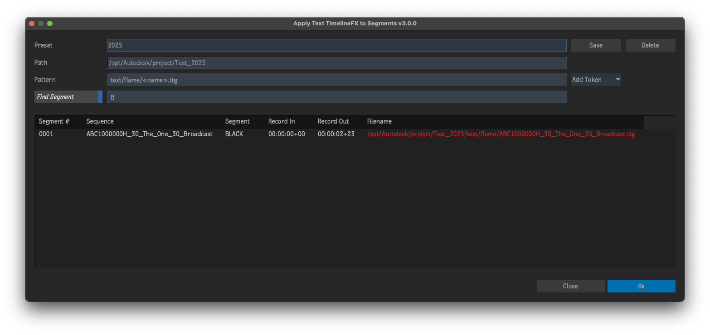

# Apply Text TimelineFX to Segments
Plugin for [Autodesk Flame software](http://www.autodesk.com/products/flame).

Find specific segments in selected sequences then apply Text TimelineFX and load Text setups based on a token pattern.  Put simply... its for loading text setups in bulk!

Detailed explanation of this script and how it fits into a complete slate workflow at [this Logik forum post](http://forum.logik.tv/t/another-slate-workflow/9434).

## Tokens
- `AM/PM`
- `am/pm`
- `Day`
- `Hour (12hr)`
- `Hour (24hr)`
- `Minute`
- `Month`
- `Project`
- `Segment Name`
- `Sequence Name`
- `User`
- `Year`

## Compatibility
|Release Version|Flame Version|
|---|---|
|v3.X.X|Flame 2025 and up|
|v2.X.X|Flame 2022 up to 2024.2|
|v1.X.X|Flame 2021 up to 2021.2|

## Installation

### Flame 2025 and newer
To make available to all users on the workstation, copy `apply_text_timeline_fx_to_segments.py` to `/opt/Autodesk/shared/python/`

For specific users, copy `apply_text_timeline_fx_to_segments.py` to the appropriate path below...
|Platform|Path|
|---|---|
|Linux|`/home/<user_name>/flame/python/`|
|Mac|`/Users/<user_name>/Library/Preferences/Autodesk/flame/python/`|

### Flame 2023.3.2 up to 2024.2
To make available to all users on the workstation, copy `apply_text_timeline_fx_to_segments.py` to `/opt/Autodesk/shared/python/`

For specific users, copy `apply_text_timeline_fx_to_segments.py` to `/opt/Autodesk/user/<user name>/python/`

### Last Step
Finally, inside of Flame, go to Flame (fish) menu `->` Python `->` Rescan Python Hooks

## Menus
- Right-click selected sequences on the Desktop `->` Apply... `->` Text TimelineFX to Segments
- Right-click selected sequences in the Media Panel `->` Apply... `->` Text TimelineFX to Segments

## Acknowledgements
UI Templates courtesy of [pyflame.com](http://www.pyflame.com)
